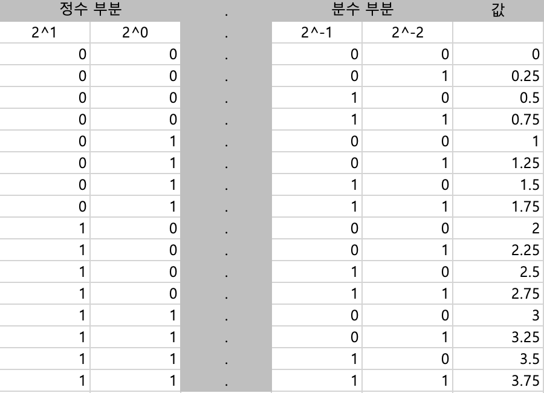
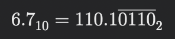

# 1. 컴퓨터 내부의 언어 체계

## 1-1. 언어란 무엇인가
**컴퓨터 언어**를 포함한 모든 언어의 뜻은 기호의 집합으로 인코딩(encoding)된다. 
이를 설명하기 위해 언어를 세 가지 구성요소로 나눌 수 있다:
- 기호가 들어갈 상자
- 상자에 들어갈 기호
- 상자의 순서

## 비트
비유된 상자는 자연어에서 **문자(character)**, 컴퓨터 언어에서는 **비트(bit)** 를 뜻한다.  
> '비트'는 2진법을 뜻하는 '바이너리(binary)'와 숫자를 의미하는 'digit'의 결합어

컴퓨터 언어에서 비트는 [1/0], [켜짐/꺼짐], [참/거짓] 같은 2진법의 기호를 담는 상자 역할을 한다.

## 논리 연산
논리 연산은 하나 이상의 입력값을 논리적으로 결합해 결과를 도출하는 연산이다.  
예를 들어, "배가 고픈가"가 참이고 "다이어트 중인가"가 거짓일 때 "밥을 먹는다"가 참이 되는 조건문이 논리 연산의 예다.

### 불리언 대수
조지 불(George Boole)은 비트 연산 규칙의 집합인 **불리언 대수(Boolean algebra)**를 정의했다. 
기본 연산자는 **NOT, AND, OR**이고, 추가로 **XOR**도 자주 사용된다. 또한 일반 대수와 마찬가지로 결합 법칙, 교환 법칙, 분배 법칙을 불리언 대수에 적용할 수 있다.

- **NOT**: 입력값을 뒤집는다.
- **AND**: 모든 입력값이 참일 때만 결과가 참이다.
- **OR**: 하나라도 참이면 결과가 참이다.
- **XOR**: 입력값이 다를 때 참이다. 세 비트 이상에서도 참의 개수가 홀수면 참이다.

> 불리언 연산 진리표(truth table). TRUE는 1로, FALSE는 0으로 대응된다

### 드모르간의 법칙
오거스터스 드모르간(Augustus De Morgan)은 불리언 대수에 적용할 수 있는 **드모르간의 법칙** (De Morgan's law)을 새로 발견했다. 
이 법칙은 다음 두 가지 식으로 표현된다:
1. NOT (A AND B) = NOT A OR NOT B
2. NOT (A OR B) = NOT A AND NOT B

> 논리학, 집합론, 전자회로에서 사용되는 드모르간의 법칙

드모르간의 법칙을 통해, NOT 연산을 사용할 경우 AND연산과 OR연산이 서로 대체 가능함을 알 수 있다.

## 1-2. 정수를 비트로 표현하는 방법

#### 양의 정수 표현
10진수(decimal number) 체계에서는 값을 10의 거듭제곱으로 표현한다. 이를 밑(base)이 10이라고 한다.  

2진수(binary number)는 0과 1 두 가지 숫자만 사용해서 숫자를 표현하는 방법이다. 
각 자릿수는 오른쪽에서 왼쪽으로 이동하며 2의 제곱을 의미한다. 
각 자릿수의 값을 더하면 10진수(decimal) 숫자와 동일한 값을 얻을 수 있다.

$$
1001110100100_{(2)} = 1 \cdot 2^{12} + 0 \cdot 2^{11} + 0 \cdot 2^{10} + 1 \cdot 2^9 + 1 \cdot 2^8 + 1 \cdot 2^7 + 0 \cdot 2^6 + 1 \cdot 2^5 + 0 \cdot 2^4 + 0 \cdot 2^3 + 1 \cdot 2^2 + 0 \cdot 2^1 + 0 \cdot 2^0
$$

$$
= 4096 + 0 + 0 + 512 + 256 + 128 + 0 + 32 + 0 + 0 + 4 + 0 + 0
$$

$$
= 5028_{(10)}
$$

+ 2진수에서 가장 오른쪽의 비트를 가장 작은 유효 비트(Least significant bit; **LSB**)라고 하고,  가장 왼쪽의 비트를 가장 큰 유효 비트(Most significant bit; **MSB**)라고 한다.

#### 2진수 덧셈

10진 덧셈과 동일하게 2진수에서도 각 비트를 LSB에서 MSB 쪽으로 더하며 결과가 1보다 크면 1을 다음 자리로 옮긴다. 

ex) 1은 2진수로 001이고, 5는 2진수로 101이다. 이를 합하면 110(2) = 6(10)이 된다.

> 컴퓨터 하드웨어가 2진수 덧셈을 수행할 때는 AND 연산과 XOR 연산을 사용한다.

그러나 덧셈 결과가 사용할 비트의 개수로 표현될 수 있는 범위를 벗어나면 어떻게 될까?  
이 경우 MSB에서 올림이 발생하게 되며, 이를 **오버플로(overflow)** 라고 한다.

#### 예시: 4비트 덧셈에서 오버플로
4비트 연산에서 \(1001_2\) + \(1000_2\)를 계산한다고 가정해보자.  
- \(1001_2 = 9_{10}\), \(1000_2 = 8_{10}\)  
- 이 둘을 더하면 실제 결과는 \(10001_2 = 17_{10}\)이 되어야 한다.  

하지만, **4비트의 범위(0~15, 즉 \(0000_2\) ~ \(1111_2\))**를 벗어나기 때문에 MSB 왼쪽에 추가된 비트를 저장할 공간이 없어, 결과가 **0001**이 된다.  
즉, \(17_{10}\)이 아닌 \(1_{10}\)로 계산된다.

#### 오버플로 감지
컴퓨터는 이러한 오버플로를 감지하기 위해 **조건 코드 레지스터(Condition Code Register)** 를 사용한다.  
이 레지스터는 연산 중 발생한 특정 조건(예: 오버플로, 캐리 발생, 부호 변화 등)을 나타내는 **오버플로 비트** 를 포함한다. 이를 통해 프로그램은 오버플로를 감지하고 적절한 처리를 할 수 있다.

#### 음수 표현
2진수에선 뺄셈을 표현하기 위해 새로운 회로를 규정하지 않는다. 대신, 양수와 음수를 나타내는 비트를 MSB에 놓아 부호(sign)처럼 사용하기로 했다.(0은 양수, 1은 음수) 

음수를 표현 하기 위해 세가지 방법이 있는데 순서대로 알아보자.

1. Signed-magnitude(부호화 크기 표현법)
   - 음수를 표현하기 위해 MSB를 반전시켜 부호를 나타내고, 나머지 비트는 값의 크기를 그대로 유지.
   - 단점 : 0 중복 표현 문제, XOR과 AND를 통한 덧셈 계산 불가
2. One's complement(1의 보수)
   - 음수를 표현하기 위해 모든 비트를 반전 시킴. 덧셈 시 MSB에서 발생한 올림(carry)을 LSB로 전달하는 순환올림(end-around carry)을 추가로 수행.
   - 단점 : 0 중복 표현 문제, 덧셈 과정이 복잡(순환 올림 계산 추가 수행)
3. Two's complement(2의 보수)
   - 음수를 표현하기 위해 모든 비트를 반전 시킨 후 LSB에 1을 더함. MSB에 캐리 발생시 이 값은 버림
   - 0 중복 표현 문제가 없고, 덧셈이 자연스럽게 됨
   - 현대 컴퓨터의 표준 방식

> 2의 보수의 장점 및 이유는 위 사진을 통해 한눈에 확인할 수 있다.
> 1. **뺄셈을 덧셈으로 완벽히 대체 가능**  
>    - 2의 보수는 음수를 표현하는 방식이기 때문에, 뺄셈을 덧셈으로 변환할 수 있어 연산 회로를 단순화할 수 있음.  
>    - 예: `A - B`는 `A + (-B)`로 계산 가능.
> 2. **0이 하나밖에 없다**  
>    - 2의 보수에서는 `+0`과 `-0`이 동일하게 표현되므로, 0이 하나만 존재함.  
>    - 이로 인해 논리 회로 설계가 단순해지고, 트랜지스터를 중복으로 구성할 필요가 없음.  
>    - 결과적으로 시간과 비용 절약 가능.  
> 3. **추가적인 덧셈이 필요 없다**  
>    - 1의 보수 방식에서는 연산 후에 추가로 carry(자리 올림)를 처리해야 하지만, 2의 보수 방식에서는 이런 과정이 필요 없음.  
>    - 이는 연산 효율성을 높임.
>
> 4. **더 넓은 범위의 수 표현 가능**  
>    - 동일한 비트 수로 더 큰 범위의 음수와 양수를 표현 가능.  
>    - 예: 4비트로 표현할 경우  
>      - 2의 보수: -8 ~ +7  
>      - 부호-크기 방식: -7 ~ +7  
>
> 5. **부호 확장이 가능**  
>    - 2의 보수는 비트 확장 시 MSB(가장 왼쪽 비트, 부호 비트)를 그대로 복사하면 값이 유지됨.  
>    - 예를 들어, 4비트에서 `-3`(2의 보수로 `1101`)을 8비트로 확장하면, MSB를 복사해서 `1111 1101`로 표현 가능.  
>    - 부호 확장을 통해 연산 결과를 다른 비트 수에서도 일관되게 유지 가능.

> `11`이라는 2비트 이진수는 표현 방식에 따라 값이 달라진다. 
> Unsigned-magnitude일 경우 3, Signed-magnitude(2의 보수)일 경우 -1로 해석된다.  
따라서, 정확한 해석을 위해 표현 방식에 대한 추가 정보가 필요하다.

## 1-3. 실수를 비트로 표현하는 방법

실수를 표현하는 방법은 크게 두가지로 나뉜다.

### 1-3-1. 고정소수점 표현법

2진 소수점의 위치를 임의로 정한다. 
예를 들어, 4비트 수 2진수에선 정수 부분 2비트, 분수 부분 2비트로 나눈다.

접근 방법은 기존 2진수를 구하는 과정과 똑같지만, 쓸모 있는 범위의 실수값을 표현하기 위해 필요한 비트 수가 너무 많다는 문제점이 있어 범용 컴퓨터에선 이런 방식을 사용하지 않는다.

#### 고정소수점 방식에서 2진수 정수 및 소수 부분 계산

 

2진수 고정소수점 표현에서 **정수 부분**과 **소수 부분**을 구하는 과정은 각각 다음과 같이 진행된다.  

**1. 정수 부분 계산**  
정수 값을 **2로 나누고 나머지를 기록**하여, **LSB(최하위 비트)**부터 **MSB(최상위 비트)** 순으로 나열.

예: \( 6_{10} \)의 정수 부분을 이진수로 변환 

$$
6 \div 2 = 3 \quad \text{(나머지 0)}
$$
$$
3 \div 2 = 1 \quad \text{(나머지 1)}
$$
$$
1 \div 2 = 0 \quad \text{(나머지 1)}
$$

따라서, \( 6_{10} = 110_{2} \)이다.  

**2. 소수 부분 계산**  
소수 값을 **2로 곱하고 정수 부분을 기록**하여, **MSB부터 LSB 방향**으로 나열.

예: \( 0.7_{10} \)의 소수 부분을 이진수로 변환 

$$
0.7 \times 2 = 1.4 \quad \text{(정수 부분 1)}
$$
$$
0.4 \times 2 = 0.8 \quad \text{(정수 부분 0)}
$$
$$
0.8 \times 2 = 1.6 \quad \text{(정수 부분 1)}
$$
$$
0.6 \times 2 = 1.2 \quad \text{(정수 부분 1)}
$$
$$
0.2 \times 2 = 0.4 \quad \text{(정수 부분 0)}
$$

이를 반복하면 \( 0.7_{10} = 0.1(0110)..._2 \)로 표현되며, **무한 비트가 필요**한 값임을 알 수 있다.  

따라서, 6.7_{10} 을 고정소수점 이진수로 표현하면 다음과 같이 된다.

이는 정수 부분에서 밑이 되는  `2^0`, `2^1` 의 값을 2로 나누고, 소수 부분에서 밑이 되는  `2^{-1}`, `2^{-2}` 의 값을 2로 곱하며 각 자리 값을 순서대로 구하는 과정이다.

이러한 고정소수점 계산법은 10진수 계산에서도 동일하게 확인할 수 있다

 

고정소수점 계산 방식은 10진수에서도 동일하게 적용할 수 있음 

예: \( 21.28_{10} \)을 10진수 고정소수점 방식으로 표현한다. 

- **정수 부분 (21) 계산**  
  10으로 계속 나누어 몫이 0이 될 때까지 나머지를 기록하고, LSB부터 MSB 순으로 나열한다.

  $$
  21 \div 10 = 2 \quad \text{... 나머지 } 1
  $$
  $$
  2 \div 10 = 0 \quad \text{... 나머지 } 2
  $$

  따라서, 정수 부분은 \( 21 \)이 된다.  

- **소수 부분 (0.28) 계산**  
  10을 계속 곱하면서 정수 부분을 추출하고, MSB부터 LSB 순으로 나열한다.

  $$
  0.28 \times 10 = 2.8 \quad \text{(정수 부분 2)}
  $$
  $$
  0.8 \times 10 = 8 \quad \text{(정수 부분 8)}
  $$

  따라서, 소수 부분은 \( 0.28 \)이 된다.  

결과적으로 \( 21.28_{10} \)은 고정소수점 방식에서 정수와 소수를 각각 **정수부: 21, 소수부: 28**로 표현할 수 있다.

### 1-3-2. 부동소수점 표현법

부동소수점은 소수점을 자유롭게 이동시켜서 수를 표현하는 방식으로, 아주 크거나 아주 작은 수를 효과적으로 표현할 수 있다. IEEE 754 표준이 널리 사용된다.

부동소수점은 다음과 같이 세 부분으로 이루어진다.

부동소수점 = 부호(sign) + 지수(exponent) + 가수(mantissa or significand)

예를 들어 3.74라는 수를 이진수로 변환한다고 쳐보자,
$$
3.74_{10} \approx 11.101111_{2}
$$

3.74를 이진수로 바꾸면 대략 11.101111로 표현할 수 있다.

$$
11.101111_{2} = 1.1101111 \times 2^1
$$

>10진수에서 소수점을 왼쪽으로 옮길 때 10을 곱하는 것처럼 2진수에선 2를 곱해 왼쪽으로 옮긺

여기서, 실제 유효 숫자를 담당하는 `1.1101111` 부분을 가수라고 하고,
소수점의 위치를 결정하는 값을 지수라고 한다.

가수는 실제 수의 유효숫자를 표현하는 수를 말한다.
항상 `1.xxxx...` 형태로 표현되는데, 제일 첫 숫자는 항상 1이기 때문에 주로 제일 첫번째 1을 생략한다.

지수는 소수점의 위치를 결정하는 값으로, 수의 크기를 나타낸다.

또한 IEEE 754 방식에선 NaN과 같은 특별한 값도 나타낼 수 있다.

## 1-4. 2진 코드화한 10진수 시스템

2진 코드화한 10진수(BCD, Binary-coded decimal)
